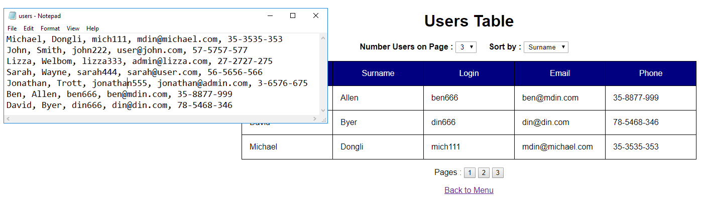

CSV Import
==========

A small Java web dynamic project
for import CSV file into database. 

[](https://travis-ci.org/babroval/csv-import)
[](https://github.com/babroval/csv-import/blob/master/LICENSE)
```
		String line = "";
		String cvsSplitBy = ",";
		try (BufferedReader br = new BufferedReader(new FileReader(csvFile))) {
			if (csvFile.length() == 0) {
				throw new RuntimeException("CSV file is empty");
			}
			List<User> allUsers = new ArrayList<User>();
			while ((line = br.readLine()) != null) {
				String[] csvLine = line.split(cvsSplitBy);
				User user = createUserEntity(csvLine);
				allUsers.add(user);
			}
```

Table of Contents
-----------------

  * [Requirements](#requirements)
  * [Usage](#usage)
  * [Contributing](#contributing)
  * [License](#license)


Requirements
------------

CSV Import requires the following to run:
  * [JRE][jre] 8
  * [Apache Tomcat Server][tomcat] 
  * [MySQL Community Server][mysql] 


Usage
-----

CSV Import is easiest to use with [Eclipse IDE][eclipse]:
File -> Import -> Git -> Projects From Git > URI

### Error handling

All exceptions are converted into unchecked type and 
intercepted by servlet to keep code clean as possible.


Contributing
------------

To contribute to CSV Import, clone this repo locally and
commit your code on a separate branch.


License
-------
Csv-import is licensed under the [MIT][mit] license.  

[jre]: http://www.oracle.com/technetwork/java/javase/downloads/
[tomcat]: https://tomcat.apache.org/download-90.cgi
[mysql]: https://dev.mysql.com/downloads/mysql/
[eclipse]: https://www.eclipse.org/downloads/
[mit]: https://github.com/babroval/csv-import/blob/master/LICENSE/